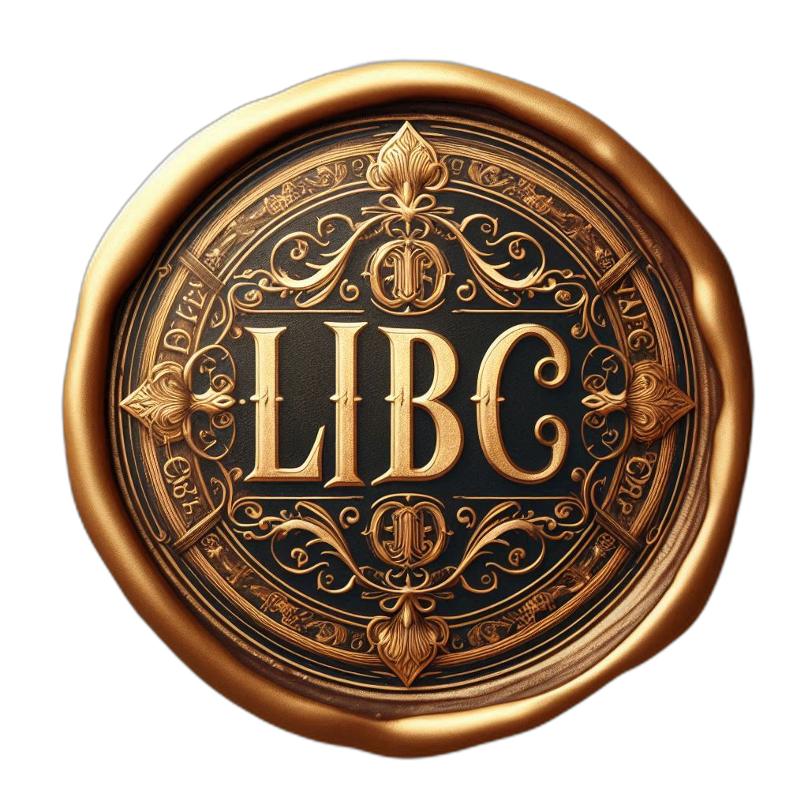

---
- 👋 Hi, I’m Davide
- 👀 I’m interested in GenAI, Computer Vision, Data Science / Engineering / Visualization, Det. and Probabilistic problems optimization, Creative Coding, Natural Language Processing.
- 📫 Please reach out on davide_vitiello@outlook.com if need be.
---

   

affiliations:
  - [ETH Zürich](https://ethz.ch/en.html)
  - [Artificial Intelligence Research (ART)](https://art.uniroma2.it/) lab. at Tor Vergata U. in Rome

email: [davide_vitiello@outlook.com](mailto:davide_vitiello@outlook.com)  
linkedin: [linkedin.com/in/davidevitiello0](https://linkedin.com/in/davidevitiello0)

Scientific Research Portfolio:
  - [orcid.org/0000-0002-8885-3934](https://orcid.org/0000-0002-8885-3934)
  - [doi.org/10.1016/j.jbc.2022.102085](https://doi.org/10.1016/j.jbc.2022.102085)
  - [doi.org/10.3389/fgene.2021.694033](https://doi.org/10.3389/fgene.2021.694033)
  - [hdl.handle.net/2108/211477](https://hdl.handle.net/2108/211477)

Have a look at my Python Tutorials for intermediate/advanced users in enterprise settings: [https://mirai-solutions.ch/python-training-material/](https://mirai-solutions.ch/py-techguides/)

   

  

    

    

    Proud adopter of LBC and IBC philosophies (LIBC):
      Logical but Creative (LBC) and Independent but Collaborative (IBC)     
    

  

<!---
Davz33/Davz33 is a ✨ special ✨ repository because its `README.md` (this file) appears on your GitHub profile.
You can click the Preview link to take a look at your changes.
--->
