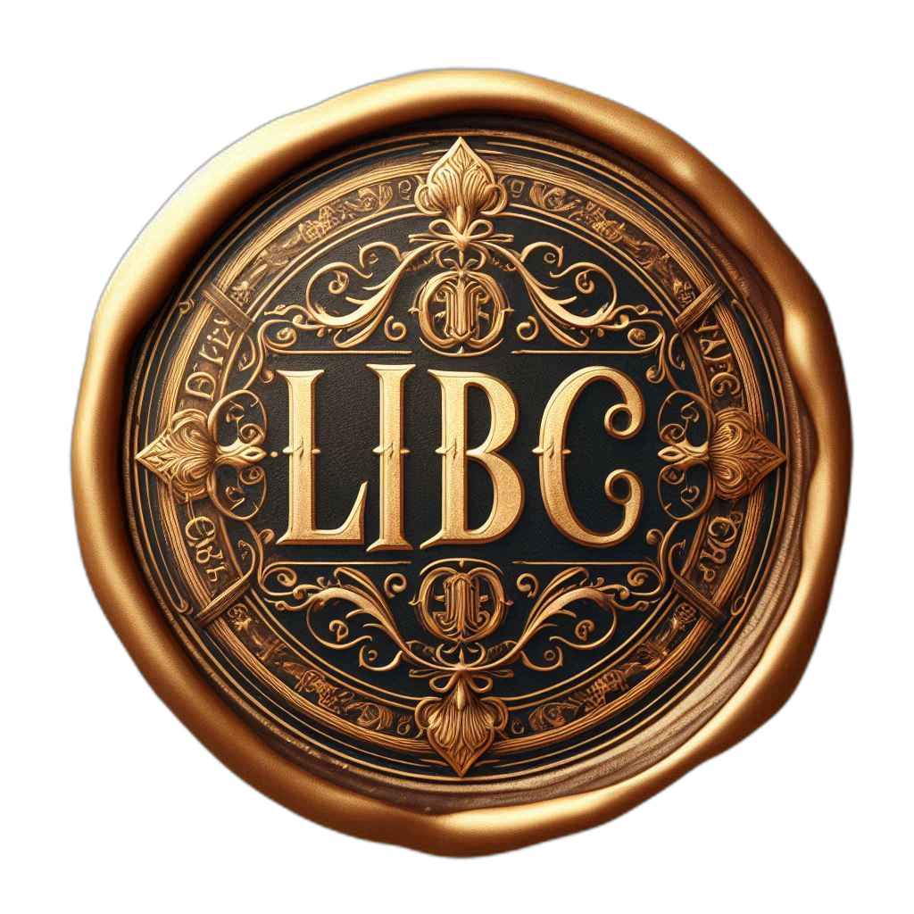

# Hi, I'm Davide 👋

### AI Engineer · Data Scientist · Health & Longevity Research

I’m a multilingual **AI Engineer and Data Scientist** based in Zurich, working at the intersection of **generative AI, cloud systems, medical science, and longevity research**.

Currently a **GenAI Engineer at [Studio Jadu](https://www.studiojadu.com/)**, I build practical AI systems for creative production. Before that I shipped data platforms and cloud tooling at Mirai Solutions (including work with Zurich Insurance and Oasis LMF), and earlier led ML for drug discovery and lifespan research.

## Experience highlights

- **GenAI Engineer — Studio Jadu** (Oct 2025–Present, Zurich) — generative AI for animation and creator workflows
- **Data & Software Engineer — Mirai Solutions** (2023–2025, Zurich) — high-performance Python/Polars analytics, Azure CI/CD, Linux runtime tuning (25–40% latency reduction)
- **Lead Data Scientist & Software Engineer — Rejuvenate Biomed** (2021–2023) — ML for drug discovery, text mining, and probabilistic modeling
- **Lead Data & Software Engineer — Rarespot** (2021–2023) — blockchain/NFT market intelligence with Python, R, SQL, and AWS
- **Scientific Researcher — ETH Zürich** (2019–2020) — CRISPR-Cas9 sgRNA generation at scale; genomic APIs and statistical models
- **Scientific Researcher — University of Liverpool** (2020–2021) — quantitative bioinformatics for lifespan extension

## Education

- **MSc, Mechatronics, Robotics, and Automation Engineering** — ETH Zürich (2017–2020)
- **BSc, Computer Science** — University of Rome Tor Vergata, *summa cum laude* (2014–2017); thesis on ontology matching visualization (OntoChord / GENOMA)
- **EITCA Artificial Intelligence** — deep learning, TensorFlow, PyTorch, Google Cloud AI (2023)

## What I’m interested in

- Evidence-based health optimization and longevity research
- Generative AI, vision, and agentic developer tooling
- Scientific analysis of supplements, protocols, and emerging therapies
- Cloud platforms (AWS, Azure), APIs, and reproducible automation
- Financial technology, risk modeling, and long-term planning
- Digital storytelling, video production, and multilingual communication

## What I build

- GenAI pipelines for creative and scientific workflows
- Research tools for organizing health and biomedical information
- Cloud and automation systems with CI/CD and security scanning
- Data platforms, dashboards, and interactive analysis tools
- Educational content and technical guidelines (e.g. Mirai Python guides)

## Tools and technologies

**Languages**  


**AI, Data & Machine Learning**  


**Cloud, DevOps & Infrastructure**  


**Tools & Frameworks**  


Top skills from day-to-day work: **Python, R, Azure, Data Science, AI Vision, Docker, TypeScript**.

## Current themes

- Building GenAI systems that keep humans in creative control
- Making longevity and biomedical research more actionable
- Lightweight, reproducible cloud and analytics workflows
- Learning, travelling, hiking, dancing, and exploring new cultures
- Communicating across English, Italian, and German-speaking contexts

## Selected projects

- [**visionflow**](https://github.com/Davz33/visionflow) — video generation & evaluation platform with WAN 2.1 and LangChain orchestration
- [**Cursor-Local-llm-MCP-proxy**](https://github.com/Davz33/Cursor-Local-llm-MCP-proxy) — MCP server for local LLMs with agent validation and speculative decoding
- [**farfalle**](https://github.com/Davz33/farfalle) — self-hosted AI search engine for local or cloud LLMs
- [**ai-ipf-aging-toolset**](https://github.com/Davz33/ai-ipf-aging-toolset) — AI toolset for IPF and aging research
- [**pdf-ai-mapper**](https://github.com/Davz33/pdf-ai-mapper) — PDF/image categorization and search with ML and OCR
- [**LLM-TabGrouping-Chrome-Extension**](https://github.com/Davz33/LLM-TabGrouping-Chrome-Extension) — Chrome extension that clusters open tabs via an LLM API

## A few principles

```text
Curiosity without rigor becomes noise.
Rigor without communication stays invisible.
The goal is useful understanding.
```

## Affiliations & research

**Affiliations**
- [Studio Jadu](https://www.linkedin.com/company/studio-jadu/)
- [ETH Zürich](https://ethz.ch/en.html)
- [Artificial Intelligence Research (ART)](https://art.uniroma2.it/) lab, Tor Vergata University (Rome)

**Scientific portfolio**
- [ORCID: 0000-0002-8885-3934](https://orcid.org/0000-0002-8885-3934)
- [doi.org/10.1016/j.jbc.2022.102085](https://doi.org/10.1016/j.jbc.2022.102085) — lifespan-associated gene expression (Coro7, Set)
- [doi.org/10.3389/fgene.2021.694033](https://doi.org/10.3389/fgene.2021.694033)
- [hdl.handle.net/2108/211477](https://hdl.handle.net/2108/211477)

**Also**
- Python technical guidelines for enterprise settings: [mirai-solutions.ch](https://mirai-solutions.ch/py-techguides/)

## Let’s connect

I’m open to conversations about GenAI, longevity research, scientific communication, cloud automation, and interesting technical experiments.

- Email: [davide_vitiello@outlook.com](mailto:davide_vitiello@outlook.com)
- LinkedIn: [linkedin.com/in/davidevitiello0](https://www.linkedin.com/in/davidevitiello0/)

---
<div align="center">
  
  <p><em>Proud adopter of LBC and IBC philosophies (LIBC):<br>Logical but Creative (LBC) and Independent but Collaborative (IBC)</em></p>
</div>
